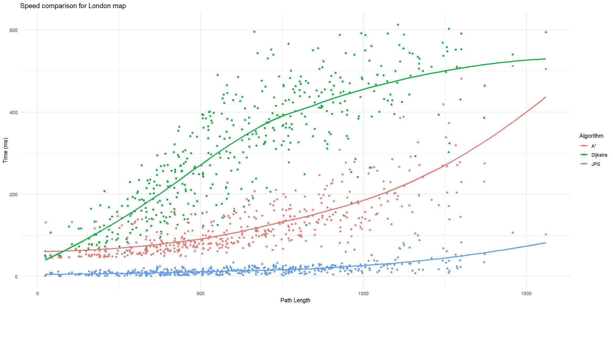
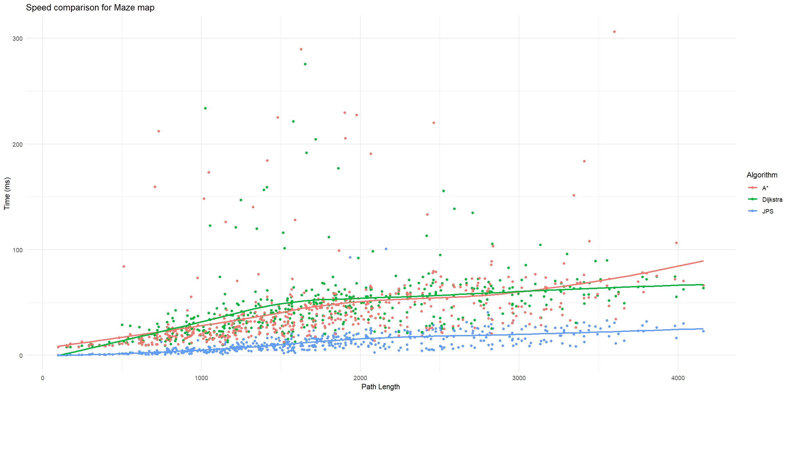
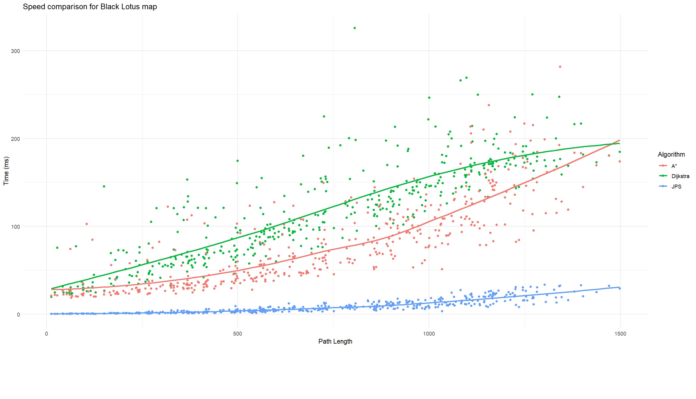
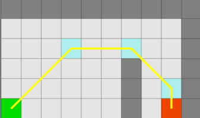

# Implementation Document

#### The implementation document explains the program's structure, the pathfinding algorithms used, performance and comparison analysis, potential shortcomings and improvement suggestions, and the use of large language models.

## The Structure of the Program

The structure of the program can be found in [design document](design_document.md)

## Implementation of the Algorithms

### Dijkstra's Shortest Path Algorithm
Dijkstra's algorithm finds the shortest path in a graph from one node to all other nodes. The time to run this algorithm is **O(n + m log n)**, where **n** is the number of nodes and **m** is the number of edges. It checks the shortest distance from the starting node to every other node, ensuring it finds the shortest possible path.

### A* Algorithm
The A* algorithm is similar to Dijkstra’s but is usually faster because it uses a heuristic to guide the search. In the worst case, it can do as much work as Dijkstra’s, but on average, it does less because it focuses on the most promising paths first. The algorithm picks the path with the smallest combined value of the distance traveled and an estimate of how close it is to the goal. This version uses the octile heuristic, which is suitable for grid-based maps, as it considers both straight and diagonal movements.

### Jump Point Search (JPS) Algorithm
The Jump Point Search (JPS) is an advanced pathfinding algorithm that enhances the performance of A* by reducing the number of nodes that need to be expanded. It accomplishes this by **pruning** unnecessary nodes and identifying **forced neighbors**.

#### Pruning
The algorithm selectively skips over nodes that do not contribute to finding the shortest path. It continues in a horizontal/vertical line or along a diagonal until the path hits an obstacle or a wall. This significantly reduces the number of nodes that need to be processed.

#### Forced Neighbors 
When obstacles are detected, the algorithm identifies "forced neighbors"—nodes that must be considered to ensure the path remains optimal despite the obstacle. These nodes ensure the search correctly navigates around obstacles while skipping unnecessary nodes. A node with a forced neighbor is evaluated similarly to how A* evaluates its nodes. If the node is identified as a jump point, it is added to the binary heap.

#### Time Complexity
JPS is generally faster than A* on grid-based maps because it skips over large grid sections, reducing the number of nodes needing processing. In tests, it was usually ten times faster than Dijkstra or A*

## Performance and Comparison Analysis
A comparison is made using three different maps. London map size 1024x1024, a big wide open map. Maze map size 512x512, a big maze map. Black Lotus map size 768x768, something between London and Maze maps. The algorithms make the tests by choosing 500 random starting and ending points. The results show that JPS is mostly always faster than Dijkstra and A*. I created the graphs using the R programming language. Here is the [R-file](./AlgorithmComparisonPlotting.R).

### London Map
The difference in performance between the algorithms is clear. Dijkstra's performance falls rapidly with increasing path lengths, while JPS maintains low computation times.

### Maze Map
While the differences are less, JPS still outperforms the other algorithms, particularly in longer paths. Dijkstra struggles more as path length increases, though not as dramatically as in the London map. A* performs less efficiently on mazes compared to other algorithms.

### Black Lotus Map
Similar observations as other maps. JPS showed superior performance across all path lengths, and Dijkstra's algorithm is the slowest.

### Thoughts of the Comparison
JPS stays fast even as the path gets longer, while A* and Dijkstra algorithms slow down noticeably with longer paths. This makes JPS an excellent choice for big maps or situations where you need quick pathfinding. For large open maps, A* is a better choice than Dijkstra, but in maze-like environments, Dijkstra might be more effective than A*.

## Shortcomings

- MainWindow.xaml.cs should be split into smaller classes. I did not have time anymore to do this.
- The Jump method also returns and adds to the open list the node where pruning begins, specifically when it identifies a node with a forced neighbor.

## Improvement Suggestions

- The first jump point(lightblue node) from the left should not be added to the open list.

- The Jump method working without recursion could solve this.
- Splitting MainWindow.xaml.cs into smaller classes
- Add an ability to view and select maps
- Information panel displaying map name and size
- Program would run on Linux and Mac

## Use of Large Language Models
- I used to improve comments and method names. I asked what is the right way to write comments on C#.
- I used to find better words for text, e.g., synonyms, word order, and how to sound more fluent.
- I used for debugging the problems with JPS at some point in the course, but it did not really help. It was always I who found the problem.
- I used to ask where the specific class should belong and why, e.g., should GraphBuilder be in services or managers.
- I used to help to create GUI because I had little time.
- I used ChatGPT to educate myself, not solve my problems, but to create better comments and text. I write much better comments after this course :)