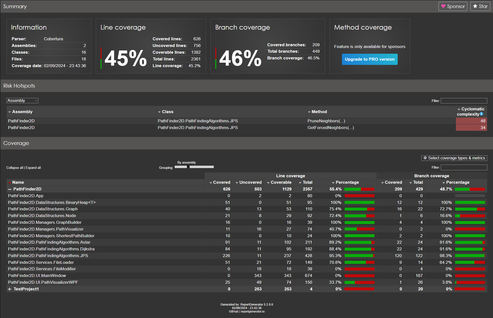

# Testing document

## Unit testing
Unit testing was made by using NUint and NUnit 3 Test Adapter

## Creating coverage report
Run [generate-coverage-report.bat](./../PathFinder2D/PathFinder2D.Tests/PathFinder2D.Tests/generate-coverage-report.bat) to create a coverage report. It works only on Windows!

## Test coverage
Program have 45% line coverage and 46% branch coverage. Dijkstra has 88,4%, A* has 89,2% and JPS 95,3% coverage. Missing percent come from helper functions, which are not essential for the algorithms to work. They are used to retrieve saved information.

## Tests
I previously ran the tests with 100 rounds multiple times but have now adjusted the rounds to 30. Occasionally, A* outperforms JPS, but this is a rare occurrence.

### File_Can_Be_Loaded_Test
Verifies that a specific test map file can be loaded correctly by comparing its content to an expected string.

### ShortestPathInLondonMapIsRightLength 
Tests whether the JPS algorithm finds the correct shortest path length from corner to corner on the London map, comparing it to an expected length.

### MazeMapPathSameLength
Verifies that the path lengths found by JPS, Dijkstra, and A* on the Maze map are the same and match an expected path length.

### Path Length Consistency Tests (IterateBlackLotusMapPathSameLength, IterateMazeMapPathSameLength, IterateLondonMapPathSameLength)
These tests guarantee that the paths found by the JPS, Dijkstra, and A* algorithms are consistent in length across different maps (Black Lotus, Maze, and London). Each test runs multiple iterations, checking that the shortest path length determined by JPS matches those found by Dijkstra and A*. The goal is to confirm that all three algorithms produce equivalent path lengths.

### Performance Comparison Tests (IterateBlackLotusMapMultipleTimes, IterateMazeMapMultipleTimes, IterateLondonMapMultipleTimes)
These tests compare the speed of the JPS, Dijkstra, and A* algorithms across the Black Lotus, Maze, and London maps. In each test, the algorithms are executed multiple times, and their execution times are compared to determine which algorithm is faster more frequently. The results, including execution time, visited nodes, and path lengths, are logged into CSV files for further analysis(). These tests aim to evaluate the relative performance of the algorithms on different map types.