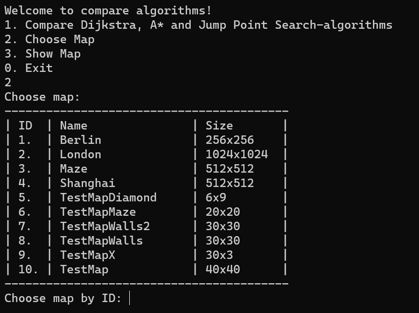
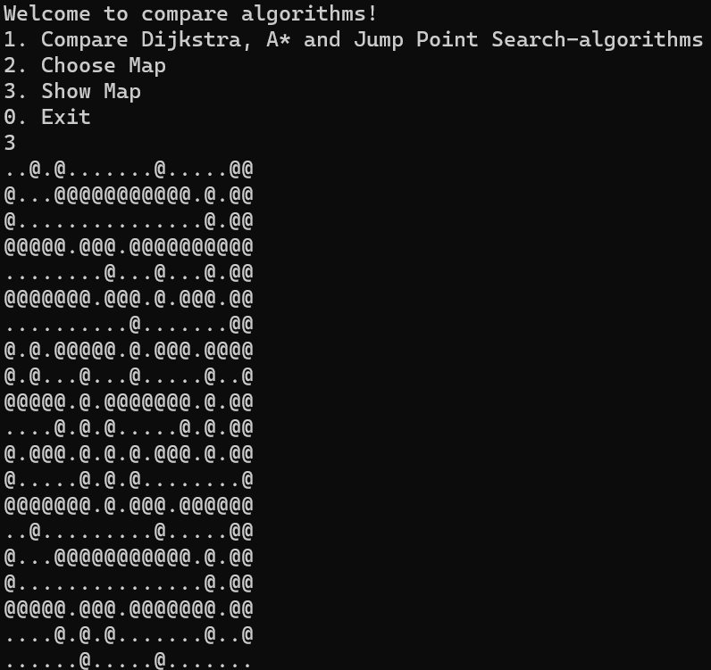
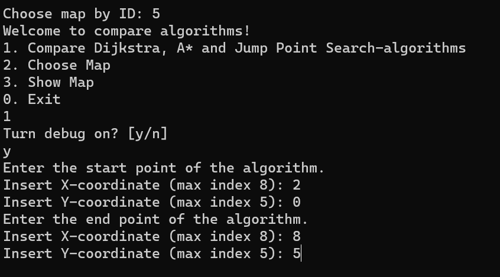
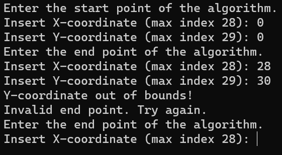

# User Guide

#### This program is developed using Windows, thus it is recommended to use it. To test the program on Linux or Mac, follow the installation instructions below.

## Installation to Linux, Mac or Windows

1. Choose correct OS, download latest [dotnet SDK](https://dotnet.microsoft.com/en-us/download/dotnet/8.0) and install it.

2. Open CLI or CMD and clone the repository:
```bash
git clone https://github.com/opturtio/PathFinder.git
```

3. Navigate to the project directory:
```bash
cd PathFinder/PathFinder
```

4. Build the project:
```bash
dotnet build
```

5. Run the project:
```bash
dotnet run
```

Note: There might be problems with packages. Follow the instructions provided by the CLI to resolve any issues.


## Installation for Windows with Visual Studio 2022
#### (Best option to test the program because it is developed this way)

1. Install [Git](https://git-scm.com/download/win) for Windows.

2. Download and installing [Visual Studio 2022](https://visualstudio.microsoft.com/thank-you-downloading-visual-studio/?sku=Community&channel=Release&version=VS2022&source=VSLandingPage&passive=false&cid=2030). (Choose from workloads .NET desktop development)

3. Clone the project in Visual Studio 2022 or clone the repository using the command prompt:
```bash
git clone https://github.com/opturtio/PathFinder.git
```

4. Open the project in Visual Studio 2022 by navigating to ./PathFinder/PathFinder.sln. Dependencies should install automatically. If prompted, proceed with the installation of the .NET Runtime environment. Additionally, you can install it manually: [.NET for Windows](https://dotnet.microsoft.com/en-us/download/visual-studio-sdks). 

5. Press  button to start the program.


## Debugger: Character Representation

#### Wall: `@`

#### Visited: `#`

#### Current: `X`

#### Start: `E`

#### Goal: `G`

#### Jump Point: `J`


## How to use the program

### The main window


### Choosing the map

#### First, the user has to choose the map for comparison by selecting 2 and then choose the map by its ID.



### Show the map

#### After choosing the map, you can see the map by pressing 3. This step is optional. Remember, you can zoom in and out on the console screen to see the maps better, which is essential for large maps.



### Algorithm comparison

#### Compare algorithms by pressing 1. Decide whether to turn on the debug mode by selecting `y` or `n`. Then, enter the coordinates.



#### Choosing out-of-bound coordinates lets you choose coordinates again. The coordinates are given between zero and max value.



### Result screen

#### Finally, view the search results. You may need to scroll up to see other algorithms' shortest paths.
