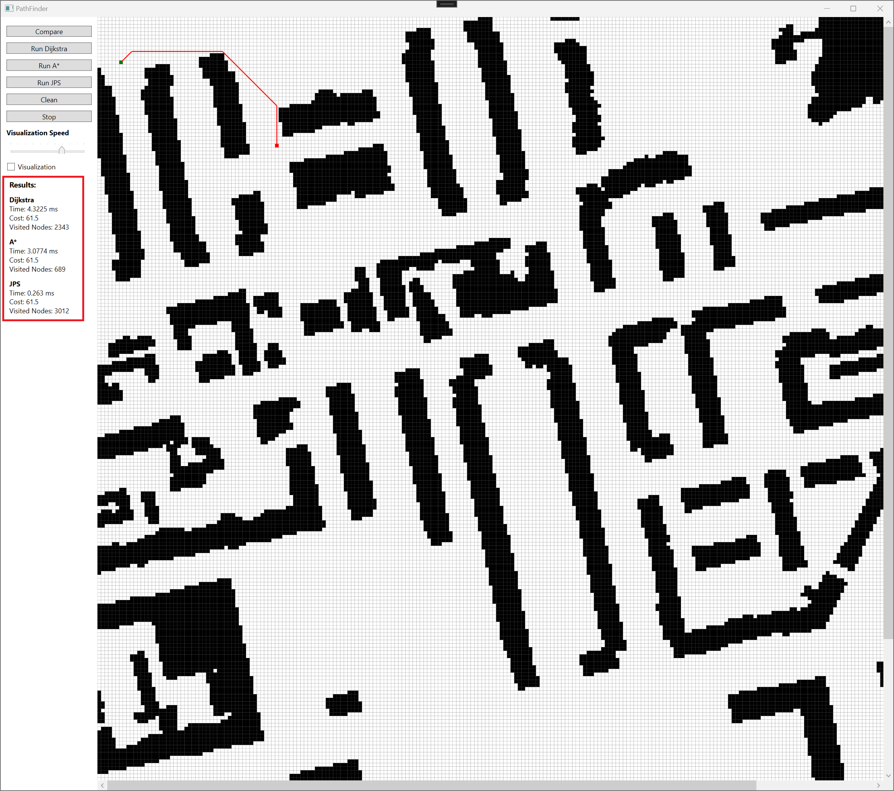

# User Guide

#### This program is developed using Windows, thus it is recommended to use it.

## Installation

Install [Git](https://git-scm.com/download/win) for Windows.

Clone the repository using the command prompt:
```bash
git clone https://github.com/opturtio/PathFinder.git
```

I recommend to download and installing [Visual Studio 2022](https://visualstudio.microsoft.com/thank-you-downloading-visual-studio/?sku=Community&channel=Release&version=VS2022&source=VSLandingPage&passive=false&cid=2030).


Open the project in Visual Studio 2022. It should automatically install all dependencies/packages.

### Debugger: Character Representation

#### Wall: @

#### Visited: \#

#### Current: X

#### Start: E

#### Goal: G

#### Jump point: J


## How to use the program

### The main window


### Choosing the map

#### First, the user has to choose the map for comparison by selecting 2 and then choose the map by its ID.


### Show the map

#### After choosing the map, you can see the map by pressing 3. This is optional. Remember, you can zoom in and out on the console screen. This is essential when you choose a large map and want to see it.


### Algorithm comparison

#### Compare algorithms by pressing 1. Choose if you want to turn on the debug mode by selecting y or n. Then, choose the coordinates.


#### Choosing out-of-bound coordinates lets you choose coordinates again.


### Result screen

#### In the end, you can see the search results. You can scroll up to see other algorithms' shortest paths.

