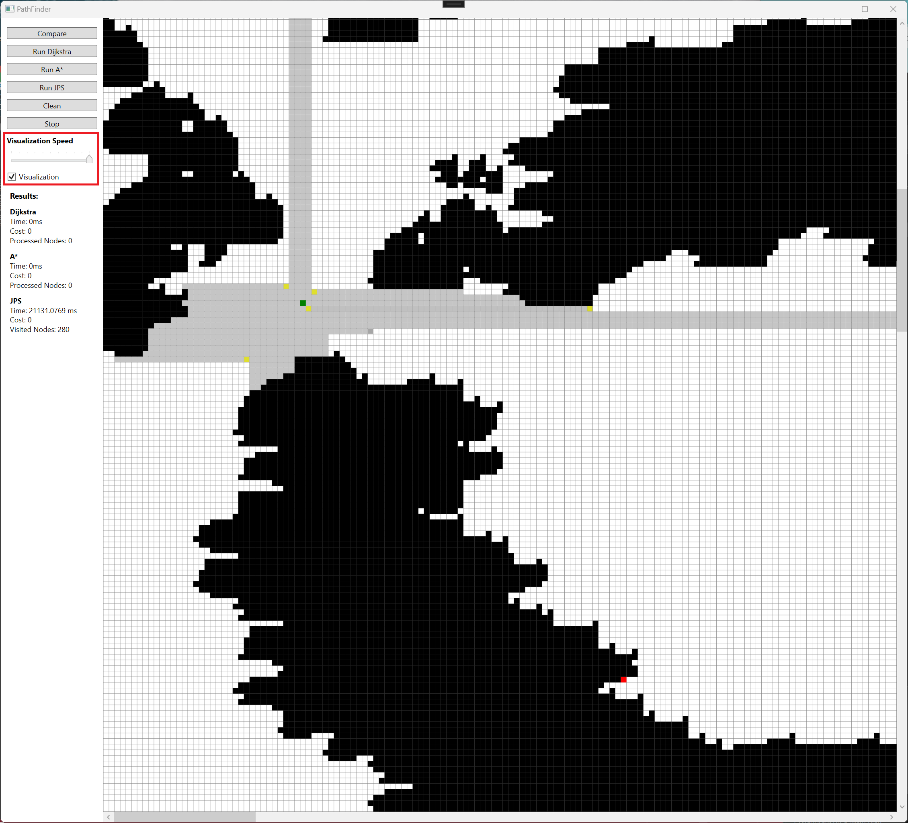

# User Guide

#### This program is developed using Windows, thus it is recommended to use it. To test the program on Linux or Mac, follow the installation instructions below.

## Installation to Linux, Mac or Windows

1. Choose correct OS, download latest [dotnet SDK](https://dotnet.microsoft.com/en-us/download/dotnet/8.0) and install it.

2. Open CLI or CMD and clone the repository:
```bash
git clone https://github.com/opturtio/PathFinder.git
```

3. Navigate to the project directory:
```bash
cd PathFinder/PathFinder
```

4. Build the project:
```bash
dotnet build
```

5. Run the project:
```bash
dotnet run
```

Note: There might be problems with packages. Follow the instructions provided by the CLI to resolve any issues.


## Installation for Windows with Visual Studio 2022
#### (Best option to test the program because it is developed this way)

1. Install [Git](https://git-scm.com/download/win) for Windows.

2. Download and installing [Visual Studio 2022](https://visualstudio.microsoft.com/thank-you-downloading-visual-studio/?sku=Community&channel=Release&version=VS2022&source=VSLandingPage&passive=false&cid=2030). (Choose from workloads .NET desktop development)

3. Clone the project in Visual Studio 2022 or clone the repository using the command prompt:
```bash
git clone https://github.com/opturtio/PathFinder.git
```

4. Open the project in Visual Studio 2022 by navigating to ./PathFinder/PathFinder.sln. Dependencies should install automatically. If prompted, proceed with the installation of the .NET Runtime environment. Additionally, you can install it manually: [.NET for Windows](https://dotnet.microsoft.com/en-us/download/visual-studio-sdks). 

5. Press  button to start the program.


## How to use the program

### The main window

You can zoom in and out using the mouse wheel. Move around the screen with the arrow keys. To set the start and end points, first left-click on a free spots(white) on the map to choose the start point, and then left-click again to choose the end point. Black areas are the walls.


### Drag and drop the map

You can select any map from the [2D Pathfinding Benchmarks](https://www.movingai.com/benchmarks/grids.html) website. To add a map to the program, simply download and unzip the file, then drag and drop it onto the canvas. Berlin map size 256x256 is the default map.

### Algorithm comparison

Choose the start and end points on the map, then press the "Compare" button to compare algorithms. You can also select a specific algorithm to run by pressing "Run Dijkstra", "Run A*" or "Run JPS". You can stop the algorithm by pressing stop and clean the whole screen by pressing clean.


### Visualization

To enable visualization, select the checkbox. Once enabled, you can see the visualization when comparing algorithms. You can adjust the speed of the visualization using the slider.



### Result screen

Finally, view the results. You can see the results under the visulization checkbox.
